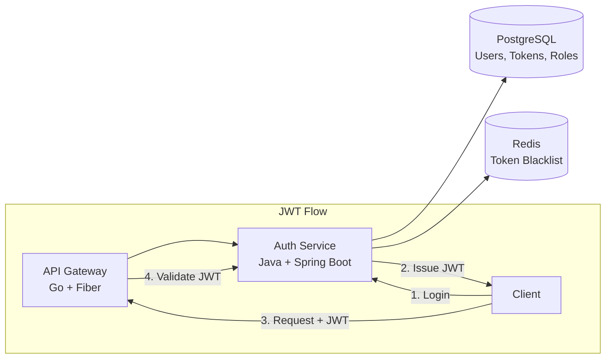

<p align="center">
  
</p>

<p align="center">
  
  
  
  
  
</p>

---

## 📝 Overview

**Auth Service** is the central identity and access management (IAM) service for the A4AD Forum. It handles user registration, authentication, JWT token management, and role-based access control (RBAC) with support for user, moderator, and admin roles.

---

## ✨ Features

- 👤 **User Registration** — Secure sign-up with email validation
- 🔐 **Authentication** — Login with JWT access and refresh tokens
- 🎫 **Token Management** — Access token refresh and secure token storage
- 👥 **Role-Based Access** — Hierarchical roles: user, moderator, admin
- 🔑 **Permission System** — Granular permissions for fine-grained access control
- 🛡️ **Security** — BCrypt password hashing, rate limiting, brute-force protection
- 📊 **Audit Logging** — Track authentication events and security incidents
- 🔄 **Session Management** — Multi-device session support with revocation

---

## 🛠 Tech Stack

- **Language:** Java 21 (LTS)
- **Framework:** Spring Boot 3.3+
- **Security:** Spring Security 6 + OAuth2 Resource Server
- **JWT:** jjwt library for token signing and validation
- **Database:** PostgreSQL 16+
- **ORM:** Spring Data JPA + Hibernate
- **Migrations:** Liquibase or Flyway
- **Validation:** Jakarta Bean Validation
- **Build Tool:** Maven

---

## 📊 Architecture



---

## 🚀 Quick Start

### Prerequisites

- Java 21 or higher
- Maven 3.9+
- PostgreSQL 16+
- Docker & Docker Compose (optional)

### Installation

1. **Clone the repository:**
   ```bash
   git clone https://github.com/A4AD-team/auth-service.git
   cd auth-service
   ```

2. **Install dependencies:**
   ```bash
   mvn clean install
   ```

3. **Start PostgreSQL:**
   ```bash
   docker compose up -d postgres
   ```

4. **Configure environment:**
   ```bash
   cp .env.example .env
   # Edit .env with your database credentials and JWT secrets
   ```

5. **Run database migrations:**
   ```bash
   mvn liquibase:update
   ```

6. **Run the service:**
   ```bash
   # Development mode
   mvn spring-boot:run -Dspring.profiles.active=local
   
   # Or build and run
   mvn clean package
   java -jar target/auth-service-0.1.0.jar
   ```

The service will be available at `http://localhost:8081`

---

## 🔧 Environment Variables

| Variable | Description | Default | Required |
|----------|-------------|---------|----------|
| `SPRING_PROFILES_ACTIVE` | Active Spring profile | `local` | No |
| `SERVER_PORT` | HTTP server port | `8081` | No |
| `SPRING_DATASOURCE_URL` | PostgreSQL JDBC URL | `jdbc:postgresql://localhost:5432/auth_db` | Yes |
| `SPRING_DATASOURCE_USERNAME` | Database username | `auth_user` | Yes |
| `SPRING_DATASOURCE_PASSWORD` | Database password | `` | Yes |
| `JWT_SECRET` | JWT signing secret (min 256 bits) | `` | Yes |
| `JWT_ACCESS_TOKEN_EXPIRATION` | Access token TTL in ms | `900000` (15 min) | No |
| `JWT_REFRESH_TOKEN_EXPIRATION` | Refresh token TTL in ms | `604800000` (7 days) | No |
| `REDIS_HOST` | Redis hostname | `localhost` | Yes |
| `REDIS_PORT` | Redis port | `6379` | No |
| `REDIS_PASSWORD` | Redis password | `` | No |
| `MAX_LOGIN_ATTEMPTS` | Failed login attempts before lockout | `5` | No |
| `LOCKOUT_DURATION_MINUTES` | Account lockout duration | `30` | No |
| `LOG_LEVEL` | Logging level | `INFO` | No |

---

## 📡 API Endpoints

### Authentication

| Method | Path | Description | Auth Required |
|--------|------|-------------|---------------|
| `POST` | `/api/v1/auth/sign-up` | Register new user | No |
| `POST` | `/api/v1/auth/sign-in` | User login | No |
| `POST` | `/api/v1/auth/refresh` | Refresh access token | No |
| `POST` | `/api/v1/auth/sign-out` | Logout (invalidate token) | Yes |

### User Management

| Method | Path | Description | Auth Required |
|--------|------|-------------|---------------|
| `GET` | `/api/v1/users/me` | Get current user info | Yes |
| `PATCH` | `/api/v1/users/me` | Update current user | Yes |
| `DELETE` | `/api/v1/users/me` | Delete own account | Yes |
| `GET` | `/api/v1/users/:id` | Get user by ID (admin only) | Yes + Admin |
| `GET` | `/api/v1/users` | List all users (admin only) | Yes + Admin |

### Roles & Permissions

| Method | Path | Description | Auth Required |
|--------|------|-------------|---------------|
| `GET` | `/api/v1/roles` | List all roles | Yes |
| `GET` | `/api/v1/roles/:id` | Get role details | Yes |
| `POST` | `/api/v1/roles` | Create new role | Yes + Admin |
| `POST` | `/api/v1/users/:id/roles` | Assign role to user | Yes + Admin |
| `DELETE` | `/api/v1/users/:id/roles/:roleId` | Remove role from user | Yes + Admin |

---

## 🩺 Health Checks

Spring Boot Actuator provides health endpoints:

| Endpoint | Method | Description |
|----------|--------|-------------|
| `/actuator/health` | `GET` | Overall health status |
| `/actuator/health/liveness` | `GET` | Liveness probe for Kubernetes |
| `/actuator/health/readiness` | `GET` | Readiness probe |
| `/actuator/info` | `GET` | Application info |
| `/actuator/metrics` | `GET` | Prometheus metrics |

### Example Response

```json
{
  "status": "UP",
  "components": {
    "database": {
      "status": "UP"
    },
    "diskSpace": {
      "status": "UP"
    },
    "redis": {
      "status": "UP"
    }
  }
}
```

---

## 🧪 Testing

```bash
# Run all tests
mvn test

# Run tests with coverage
mvn clean test jacoco:report

# Run specific test class
mvn test -Dtest=AuthServiceTest

# Run specific test method
mvn test -Dtest=AuthServiceTest#testLoginSuccess

# Skip tests during build
mvn clean install -DskipTests
```

---

## 📄 License

This project is licensed under the MIT License — see the [LICENSE](LICENSE) file for details.

---

<p align="center">
  <strong>Built with ❤️ by A4AD Team</strong>
</p>
