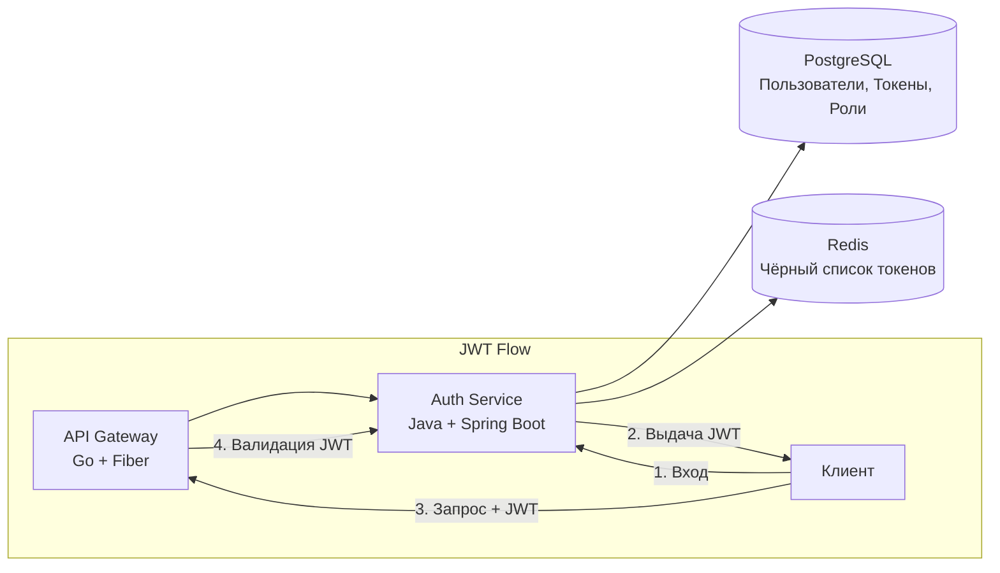

<p align="center">
  
</p>

<p align="center">
  
  
  
  
  
</p>

---

## 📝 Описание

**Auth Service** — центральный сервис управления идентификацией и доступом (IAM) для форума A4AD. Обрабатывает регистрацию пользователей, аутентификацию, управление JWT-токенами и контроль доступа на основе ролей (RBAC) с поддержкой ролей user, moderator и admin.

---

## ✨ Возможности

- 👤 **Регистрация пользователей** — Безопасная регистрация с валидацией email
- 🔐 **Аутентификация** — Вход с JWT access и refresh токенами
- 🎫 **Управление токенами** — Обновление access-токена и безопасное хранение
- 👥 **Ролевой доступ** — Иерархические роли: user, moderator, admin
- 🔑 **Система разрешений** — Детальные права для точного контроля доступа
- 🛡️ **Безопасность** — Хеширование паролей BCrypt, ограничение запросов, защита от brute-force
- 📊 **Аудит** — Отслеживание событий аутентификации и инцидентов безопасности
- 🔄 **Управление сессиями** — Поддержка нескольких устройств с возможностью отзыва

---

## 🛠 Технологический стек

- **Язык:** Java 21 (LTS)
- **Фреймворк:** Spring Boot 3.3+
- **Безопасность:** Spring Security 6 + OAuth2 Resource Server
- **JWT:** библиотека jjwt для подписи и валидации
- **База данных:** PostgreSQL 16+
- **ORM:** Spring Data JPA + Hibernate
- **Миграции:** Liquibase или Flyway
- **Валидация:** Jakarta Bean Validation
- **Сборка:** Maven

---

## 📊 Архитектура



---

## 🚀 Быстрый старт

### Требования

- Java 21 или выше
- Maven 3.9+
- PostgreSQL 16+
- Docker & Docker Compose (опционально)

### Установка

1. **Клонирование репозитория:**
   ```bash
   git clone https://github.com/A4AD-team/auth-service.git
   cd auth-service
   ```

2. **Установка зависимостей:**
   ```bash
   mvn clean install
   ```

3. **Запуск PostgreSQL:**
   ```bash
   docker compose up -d postgres
   ```

4. **Настройка окружения:**
   ```bash
   cp .env.example .env
   # Отредактируйте .env с учётными данными БД и JWT-секретами
   ```

5. **Выполнение миграций:**
   ```bash
   mvn liquibase:update
   ```

6. **Запуск сервиса:**
   ```bash
   # Режим разработки
   mvn spring-boot:run -Dspring.profiles.active=local
   
   # Или сборка и запуск
   mvn clean package
   java -jar target/auth-service-0.1.0.jar
   ```

Сервис будет доступен по адресу `http://localhost:8081`

---

## 🔧 Переменные окружения

| Переменная | Описание | Значение по умолчанию | Обязательная |
|------------|----------|----------------------|--------------|
| `SPRING_PROFILES_ACTIVE` | Активный профиль Spring | `local` | Нет |
| `SERVER_PORT` | Порт HTTP-сервера | `8081` | Нет |
| `SPRING_DATASOURCE_URL` | JDBC URL PostgreSQL | `jdbc:postgresql://localhost:5432/auth_db` | Да |
| `SPRING_DATASOURCE_USERNAME` | Имя пользователя БД | `auth_user` | Да |
| `SPRING_DATASOURCE_PASSWORD` | Пароль базы данных | `` | Да |
| `JWT_SECRET` | Секрет для подписи JWT (мин. 256 бит) | `` | Да |
| `JWT_ACCESS_TOKEN_EXPIRATION` | TTL access-токена в мс | `900000` (15 мин) | Нет |
| `JWT_REFRESH_TOKEN_EXPIRATION` | TTL refresh-токена в мс | `604800000` (7 дней) | Нет |
| `REDIS_HOST` | Хост Redis | `localhost` | Да |
| `REDIS_PORT` | Порт Redis | `6379` | Нет |
| `REDIS_PASSWORD` | Пароль Redis | `` | Нет |
| `MAX_LOGIN_ATTEMPTS` | Неудачных попыток входа до блокировки | `5` | Нет |
| `LOCKOUT_DURATION_MINUTES` | Длительность блокировки аккаунта | `30` | Нет |
| `LOG_LEVEL` | Уровень логирования | `INFO` | Нет |

---

## 📡 Эндпоинты

### Аутентификация

| Метод | Путь | Описание | Требуется авторизация |
|-------|------|----------|----------------------|
| `POST` | `/api/v1/auth/sign-up` | Регистрация нового пользователя | Нет |
| `POST` | `/api/v1/auth/sign-in` | Вход пользователя | Нет |
| `POST` | `/api/v1/auth/refresh` | Обновление access-токена | Нет |
| `POST` | `/api/v1/auth/sign-out` | Выход (инвалидация токена) | Да |

### Управление пользователями

| Метод | Путь | Описание | Требуется авторизация |
|-------|------|----------|----------------------|
| `GET` | `/api/v1/users/me` | Информация о текущем пользователе | Да |
| `PATCH` | `/api/v1/users/me` | Обновление текущего пользователя | Да |
| `DELETE` | `/api/v1/users/me` | Удаление своего аккаунта | Да |
| `GET` | `/api/v1/users/:id` | Получить пользователя по ID (только admin) | Да + Admin |
| `GET` | `/api/v1/users` | Список всех пользователей (только admin) | Да + Admin |

### Роли и разрешения

| Метод | Путь | Описание | Требуется авторизация |
|-------|------|----------|----------------------|
| `GET` | `/api/v1/roles` | Список всех ролей | Да |
| `GET` | `/api/v1/roles/:id` | Детали роли | Да |
| `POST` | `/api/v1/roles` | Создать новую роль | Да + Admin |
| `POST` | `/api/v1/users/:id/roles` | Назначить роль пользователю | Да + Admin |
| `DELETE` | `/api/v1/users/:id/roles/:roleId` | Удалить роль у пользователя | Да + Admin |

---

## 🩺 Health Checks

Spring Boot Actuator предоставляет health-эндпоинты:

| Эндпоинт | Метод | Описание |
|----------|-------|----------|
| `/actuator/health` | `GET` | Общий статус здоровья |
| `/actuator/health/liveness` | `GET` | Liveness-проба для Kubernetes |
| `/actuator/health/readiness` | `GET` | Readiness-проба |
| `/actuator/info` | `GET` | Информация о приложении |
| `/actuator/metrics` | `GET` | Метрики Prometheus |

### Пример ответа

```json
{
  "status": "UP",
  "components": {
    "database": {
      "status": "UP"
    },
    "diskSpace": {
      "status": "UP"
    },
    "redis": {
      "status": "UP"
    }
  }
}
```

---

## 🧪 Тестирование

```bash
# Запуск всех тестов
mvn test

# Запуск с покрытием
mvn clean test jacoco:report

# Запуск конкретного класса тестов
mvn test -Dtest=AuthServiceTest

# Запуск конкретного метода теста
mvn test -Dtest=AuthServiceTest#testLoginSuccess

# Пропуск тестов при сборке
mvn clean install -DskipTests
```

---

## 📄 Лицензия

Проект распространяется под лицензией MIT — подробности в файле [LICENSE](LICENSE).

---

<p align="center">
  <strong>Создано с ❤️ командой A4AD</strong>
</p>
